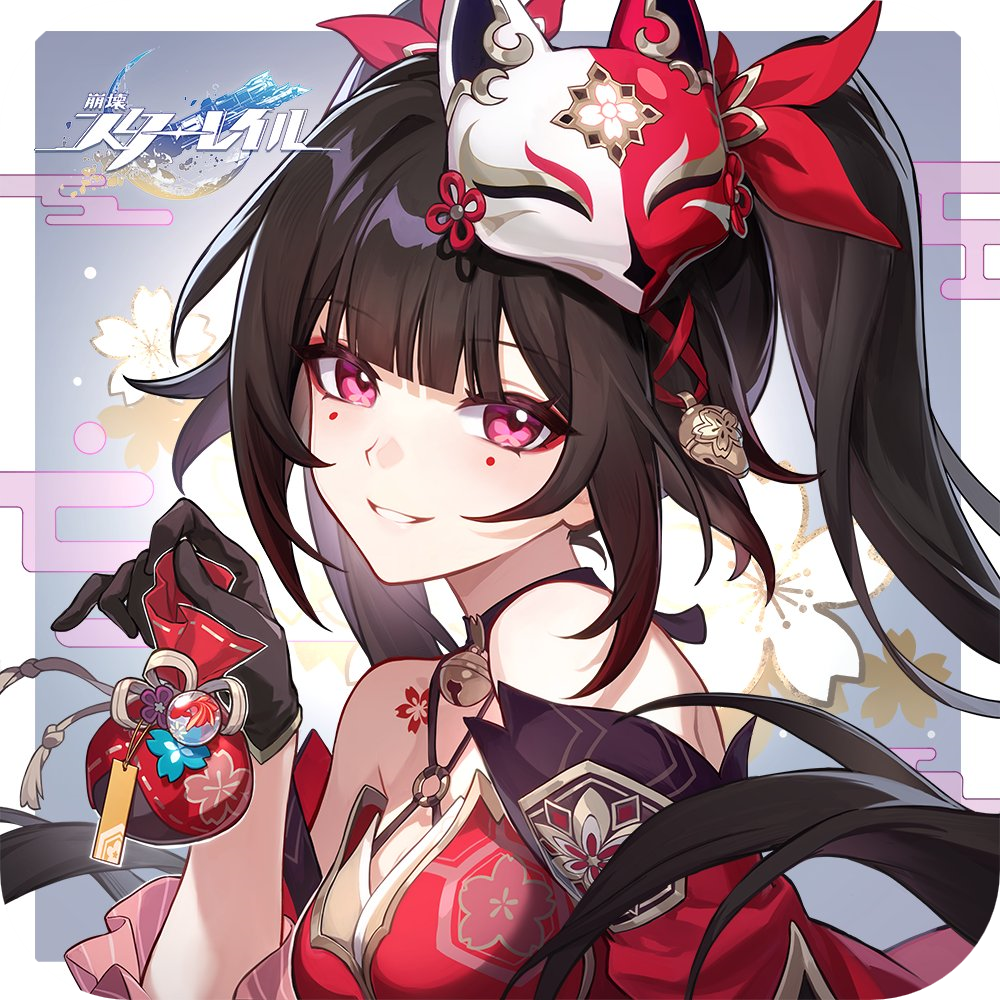
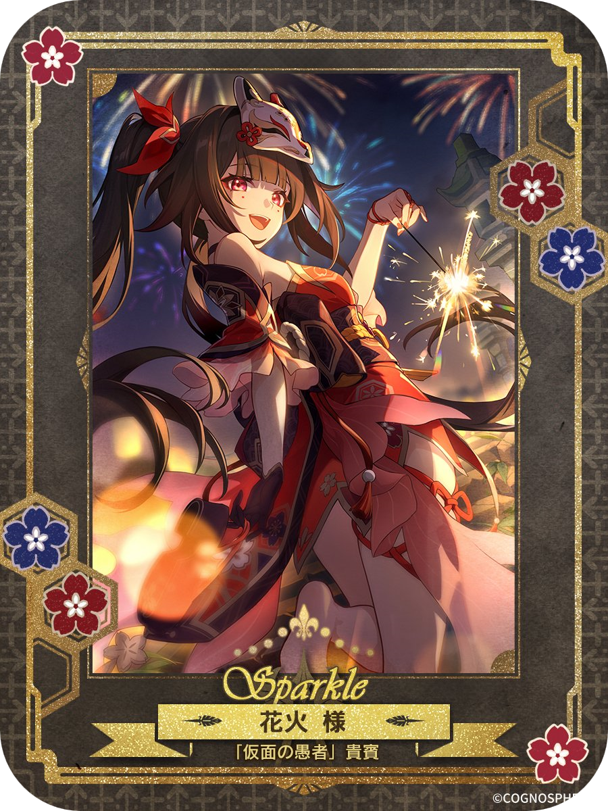

ｲｲｨｨﾝｽﾋﾟﾚｪｪｴｲｼｮｫｫｵｵｵﾝ [aiko-chan-ai](https://github.com/aiko-chan-ai)

## ABOUT

-  Student from Japan
-  Discord.js /  Jetpack Compose
-  FPS ゲーム中心  
  ↳  [VALORANT](https://playvalorant.com/) /  [Overwatch](https://overwatch.blizzard.com/) /  [APEX LEGENDS](https://www.ea.com/games/apex-legends)
- _I Love_  

## Discord BOT

趣味  
サービス継続・停止は気まぐれ

### 稼働中

- _[Timeout-Manager](https://github.com/KiRura/Timeout-Manager)_  
  タイムアウトされたメンバーが退出した時に BAN, etc...
- _[Message-Counter](https://github.com/KiRura/Message-Counter)_  
  UTC+9 日本時間 0 時にメッセージのカウント数を定期送信

### 開発中 or 放置中

- _[Anka](https://github.com/KiRura/Anka)_  
  安価

### 停止中

- _[MuTao](https://github.com/KiRura/MuTao)_  
  音楽再生, 全メンバーにロール一括付与, etc...
- _[MuPlayer](https://github.com/KiRura/MuPlayer)_  
  MuTao の音楽再生から分離

## Discord

<a href="https://discord.com/users/606093171151208448">
<picture>
  <source media="(prefers-color-scheme: dark)" srcset="https://lanyard.cnrad.dev/api/606093171151208448?bg=1c1d22&idleMessage=現実をプレイ中&showDisplayName=true&borderRadius=16px" />
   
  <source media="(prefers-color-scheme: light)" srcset="https://lanyard.cnrad.dev/api/606093171151208448?bg=1c1d22&idleMessage=現実をプレイ中&showDisplayName=true&borderRadius=16px" />
  
</picture>
</a>

## Stats

<picture>
   <source media="(prefers-color-scheme: dark)" srcset="https://github-readme-stats.vercel.app/api?username=kirura&bg_color=1c1d22&title_color=5865F2&text_color=F2F3F5&hide_border=true&locale=ja&custom_title=きるら's-Stats&number_format=long&border_radius=16&show_icons=true" />
   
   <source media="(prefers-color-scheme: light)" srcset="https://github-readme-stats.vercel.app/api?username=kirura&bg_color=F2F3F5&title_color=5865F2&text_color=060607&hide_border=true&locale=ja&custom_title=きるら's-Stats&number_format=long&border_radius=16&show_icons=true" />
   
 </picture>
<picture>
  <source media="(prefers-color-scheme: dark)" srcset="https://github-readme-streak-stats.herokuapp.com?user=KiRura&theme=tokyonight&hide_border=true&border_radius=16&locale=ja"/>
  <source media="(prefers-color-scheme: light)" srcset="https://github-readme-streak-stats.herokuapp.com?user=KiRura&theme=tokyonight&hide_border=true&border_radius=16&locale=ja"/>
  
</picture>

## Star History

<a href="https://star-history.com/#kirura/mutao&KiRura/Timeout-Manager&KiRura/Message-Counter&Date">
 <picture>
   <source media="(prefers-color-scheme: dark)" srcset="https://api.star-history.com/svg?repos=KiRura/MuTao,KiRura/Timeout-Manager,KiRura/Message-Counter&type=Date&theme=dark" />
   <source media="(prefers-color-scheme: light)" srcset="https://api.star-history.com/svg?repos=KiRura/MuTao,KiRura/Timeout-Manager,KiRura/Message-Counter&type=Date" />
   
 </picture>
</a>

## Thanks for reading

